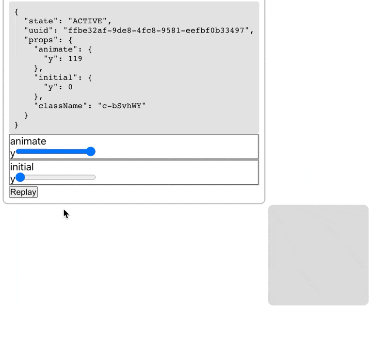
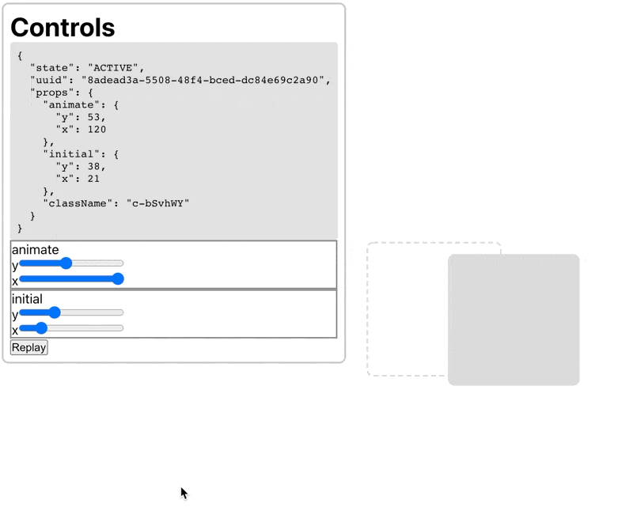
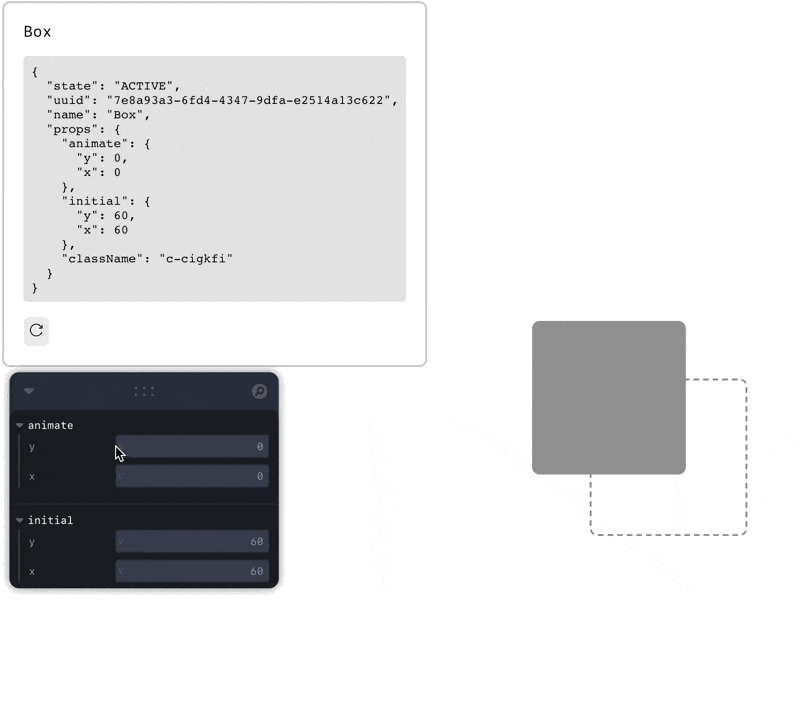
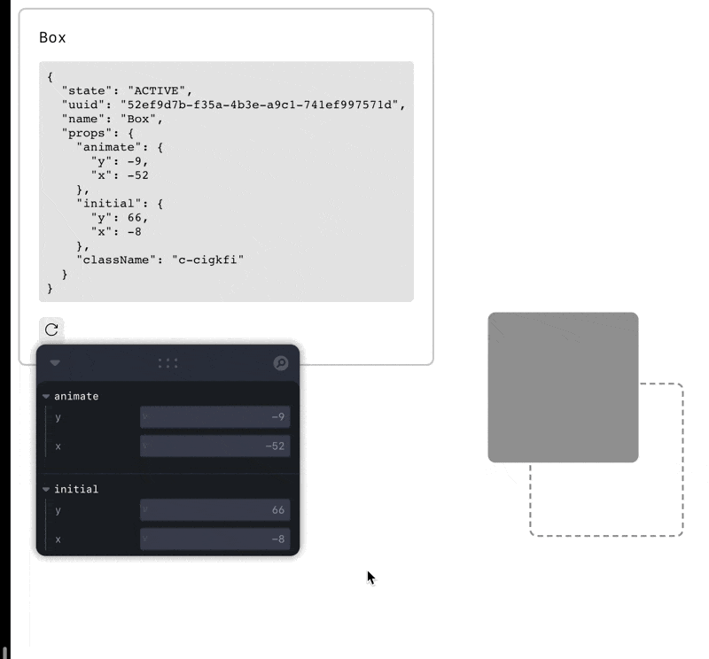

# Framer Motion Dev Tools

How would I go about implementing something like this? https://twitter.com/raunofreiberg/status/1448682856620953610

- How do you determine which React component the cursor is pointing to?
- Given this React component, how do you update its props?

## Part 1: UI to Update Animation Values

One thing I can do is create a custom wrapper around the `motion` function exported from `framer-motion`, and force the rest of the app to use that thin wrapper instead of the base framer-motion one.

This wrapper will work in conjunction with a context object to allow the dev tool to modify the component's props. The context object will have the following type:

```ts
type MotionToolContext = {
  state: 'IDLE'
} | {
  state: 'WAIT',
  uuid: string
} | {
  state: 'ACTIVE',
  uuid: string
  props: MotionProps // things like `animate`, `initial`, `variants`, etc.
}
```

The `motion` wrapper will then:

1. Generate a uuid for the component,
2. Attach the uuid to the underlying DOM element,
3. Intercept the given motion props, changing the prop that is passed to the underlying component depending on the context state:
   1. If context state === 'WAIT', set the context props to the given props and return
   2. If context state === 'ACTIVE', pass the props defined in context to the underlying component

When you click on a component with the option key pressed:

1. Read the `uuid` from the element's `dataset` property and update context with that `uuid`, transitioning the context state from 'IDLE' to 'WAIT'

## Part 2: Update Code With New Animation Values

TODO

## Learnings

- `motion` doesn't build all possible html elements; instead, each element is generated using a `createMotionComponent` function and later cached.
  - This means you can't simply iterate over all elements and wrap them

## Notes

### Oct 16 2021

I'm able to get a working version that allows me to update the _end_ animation of the component using a slider:


The problem is updating `initial` doesn't _appear_ to do anything even though it's updating the props correctly:


This is because `initial` only makes a difference when the component initially mounts, whereas the approach I'm using simply rerenders the given component. Another issue is that updating `animate` doesn't really tell me what the final animation will look like - only where the element will end up in the end.

What would be more useful would be if the animation is replayed from the beginning (i.e. from `initial` to `animate`) every time we change the values in the control panel.

To force the animation to replay, we need to remount the component. We can force a remount of the component using the `key` prop like so:

```jsx
export function Motion({ as = "div", ...props }) {
  const [key, setKey] = React.useState(uuid());
  const context = useMotionDevToolContext();

  const realProps = context.state === "ACTIVE" ? context.props : props;

  /**
   * Every time the props we pass change, update the key to replay the 
   * animation from the start. We use `uuid` as the key to ensure our key is 
   * unique across the whole app.
   */ 
  React.useEffect(() => {
    setKey(uuid());
  }, [realProps]);

  const Component = baseMotion[as];
  return <Component key={key} {...realProps} />;
}
```

This turned out to be a bit jittery, so I changed this to be a "Replay" button instead:



The implementation is a bit different, but it relies on the same principle of updating the key to modify the animation.

1. When the replay button is pressed, the state gets updated to `WAIT_REPLAY`. 
2. The motion component listens to that state change and remounts the component by updating the `key` prop.
3. The motion component updates the control state back to `ACTIVE` by sending a `ANIMATION_DONE` event.

This approach still has the problem of not having feedback for the `initial` slider. How do we create a good experience for adjusting the `initial` slider?

My solution is to add a transparent box that represents the initial position of the element you're animating:



For the sake of this POC, I added a wrapper around the underlying motion component in order to correctly render the transparent box:

```tsx
<Wrapper>
  {initial && (
    <InitialBox
      className={props.className}
      style={{ x: initial.x, y: initial.y }}
    />
  )}
  <Component data-id={id} key={key} {...realProps} />
</Wrapper>
```

The issue with this is that our custom motion wrapper doesn't render exactly what the original motion component does. This may cause issues if the wrapper expects a certain DOM structure.

The next two important features are:

1. Make the API match the default `motion` API (i.e. usable like `motion.div ...`)
2. Add the ability to update transitions

### Oct 17 2021

I've decided to migrate to use [leva](https://github.com/pmndrs/leva) for the control panel off a suggestion by [Maxime](https://twitter.com/MaximeHeckel/status/1449514560684187650). This lets me focus on implementing the motion dev tool instead of worrying about the style of the control panel.

> Using a third party lib does mean that I'm limited on what I'm able to control — right now it doesn't look like it's an issue, but this might change in the future.

In order to use Leva, I needed to convert the props of the motion component to the Leva schema:

```ts
const componentProps = {
  animate: {
    y: 0,
    x: 0
  },
  initial: {
    y: 60,
    x: 60
  }
}

const levaSchema = {
  animate: {
    x: {
      value: 0,
      onChange: (x) => onChange({ ...props, animate: { ...animate, x } })
    }
    ...remainingProps
  }
}
```

I'm running into an issue where the values in the Leva component is not in sync with the motion component's state.

When modifiying one prop, the prop appears to correctly update in the motion context (as seen by the component actually moving in response to the change), but that change doesn't seem to be saved afterwards. When moving a different prop, we see that the prop immediately reverts in context:



The problem seems to be caused by a stale reference to the global props object. The solution is to let the context update the tool state while the controls should only concern themselves with the portion of props that they are updating.

More specifically, we previously only had one event for updating props, the `UPDATE_PROPS` event. This event **sets** the context's `props` object to whatever object was passed in the event:

```ts
setToolState({
  ...toolState,
  props: event.props
})
```

This meant that whatever component is sending this event needs to know about the _entire_ props object:

```ts
send({
  type: "UPDATE_PROPS",
  props: { ...contextProps, myProp: newValue }
})
```

The bug in the demo was caused because the component sending this event had an old reference to the context's props. Whatever was causing this stale reference, I wasn't sure - but either way it felt like the calling component shouldn't know about _all_ of the props being used. It should only concern itself with the slice of props that it's working with.

My solution was to introduce a new event called `SET_PROPS`, and change the old `UPDATE_PROPS` functionality to `SET_PROPS`. Then, `UPDATE_PROPS` becomes an event that allows a component to update a _slice_ of props instead of the whole thing:

```ts
send({
  type: "UPDATE_PROPS",
  path: "animate.x",
  value: 10
})
```

Then, the task of updating the actual prop object is left to the logic that handles the dev tool context.

While I wasn't sure what was causing the initial issue, this refactoring ultimately did solve the problem:


