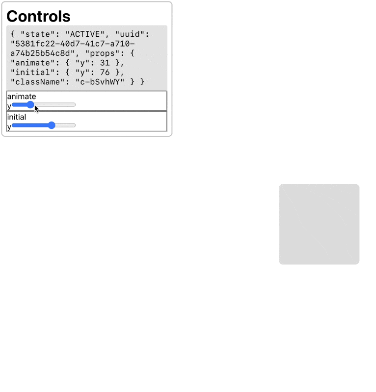
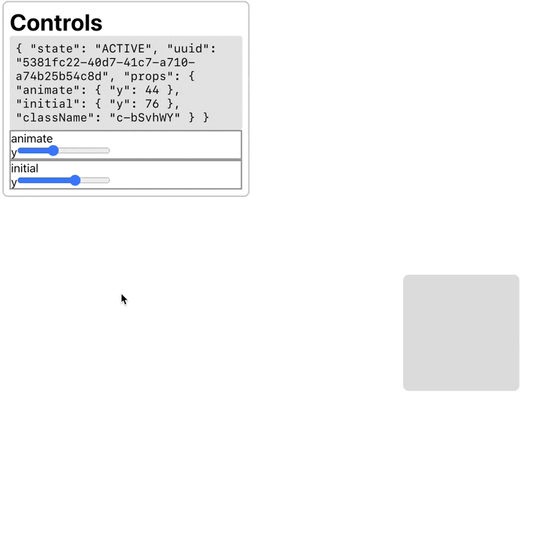

# Framer Motion Dev Tools

How would I go about implementing something like this? https://twitter.com/raunofreiberg/status/1448682856620953610

- How do you determine which React component the cursor is pointing to?
- Given this React component, how do you update its props?

## Part 1: UI to Update Animation Values

One thing I can do is create a custom wrapper around the `motion` function exported from `framer-motion`, and force the rest of the app to use that thin wrapper instead of the base framer-motion one.

This wrapper will work in conjunction with a context object to allow the dev tool to modify the component's props. The context object will have the following type:

```ts
type MotionToolContext = {
  state: 'IDLE'
} | {
  state: 'WAIT',
  uuid: string
} | {
  state: 'ACTIVE',
  uuid: string
  props: MotionProps // things like `animate`, `initial`, `variants`, etc.
}
```

The `motion` wrapper will then:

1. Generate a uuid for the component,
2. Attach the uuid to the underlying DOM element,
3. Intercept the given motion props, changing the prop that is passed to the underlying component depending on the context state:
   1. If context state === 'WAIT', set the context props to the given props and return
   2. If context state === 'ACTIVE', pass the props defined in context to the underlying component

When you click on a component with the option key pressed:

1. Read the `uuid` from the element's `dataset` property and update context with that `uuid`, transitioning the context state from 'IDLE' to 'WAIT'

## Part 2: Update Code With New Animation Values

TODO

## Learnings

- `motion` doesn't build all possible html elements; instead, each element is generated using a `createMotionComponent` function and later cached.
  - This means you can't simply iterate over all elements and wrap them

## Notes

### Oct 16 2021

I'm able to get a working version that allows me to update the _end_ animation of the component using a slider:



The problem is updating `initial` doesn't _appear_ to do anything even though it's updating the props correctly:



This is because `initial` only makes a difference when the component initially mounts, whereas the approach I'm using simply rerenders the given component. Another issue is that updating `animate` doesn't really tell me what the final animation will look like - only where the element will end up in the end.

What would be more useful would be if the animation is replayed from the beginning (i.e. from `initial` to `animate`) every time we change the values in the control panel.
